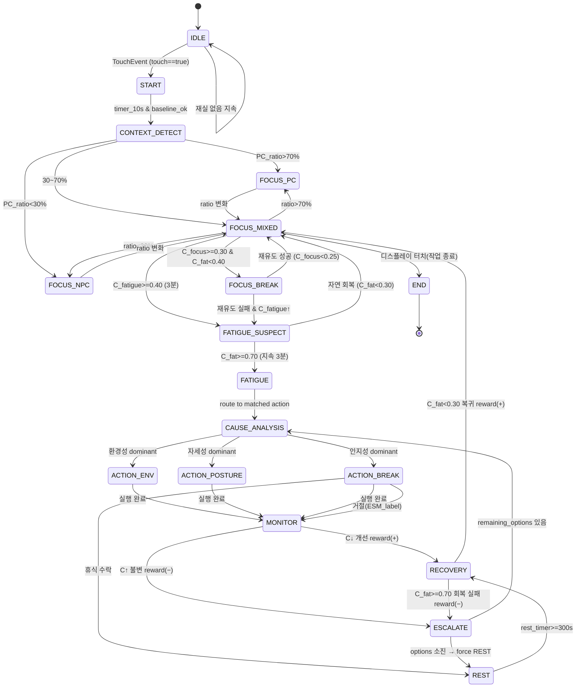

# DESKMATE FSM 시스템 개발 계획서

> 규칙 기반 유한상태기계(1단계 추론 엔진) 개발 계획
> 팀 TEAMMATE · 제24회 임베디드SW경진대회 스마트 가전 부문
> 기준 설계: `DESKMATE_FSM-VER5` 다이어그램 · 개발계획서 v2

---

## 0. 문서 개요

| 항목 | 내용 |
|---|---|
| 목적 | VER5 FSM 다이어그램을 실제 동작하는 추론 엔진 코드로 구현하기 위한 개발 계획 수립 |
| 범위 | 상태 정의 · 전이 조건 · 이중 신뢰도 수식 · 개입 라우팅 · RL 정책 갱신의 소프트웨어 구현 |
| 주 담당 | 박소연 (`hub/deskmate_hub/inference/`) |
| 협업 | 김태환(특징 추출·baseline), 조명희(2단계 분류기·제어 연동), 이민혁(MQTT ingest), 최민경(디스플레이 출력) |
| 관련 문서 | [`fsm-spec.md`](fsm-spec.md) (구현 사양), [`architecture.md`](architecture.md), [`mqtt-topics.md`](mqtt-topics.md), [`../hub/README.md`](../hub/README.md) |
| 기준 다이어그램 | `DESKMATE_FSM-VER5*.drawio` (로컬 `FSM/` 작업 폴더 — 저장소 미포함) |

> **문서 정합성 메모** — 본 계획서는 개발 *계획*(목표·일정·WBS·리스크)을, `fsm-spec.md`는
> 확정 *구현 사양*(18상태·이중 모니터링·임계값)을 담는다. `fsm-spec.md`는 VER5 기준으로
> 갱신 완료됐고, 엔진 스켈레톤은 `feat/fsm` 브랜치에 구현되어 있다(§7·현황은 `CLAUDE.md` §6).

---

## 1. 개발 목표 및 설계 원칙

### 1.1 목표
- **C_fatigue(피로도) · C_focus(집중도) 이중 모니터링** 기반의 규칙 FSM을 완전 오프라인으로 동작시킨다.
- 컨텍스트(PC / 혼용 / 비PC)에 따라 신호 가중치를 전환하여 작업 유형별로 판정을 적응시킨다.
- 피로 확정 시 **원인을 분석(dominant term)** 하여 환경·자세·인지 개입을 라우팅하고,
  개입 효과를 검증(MONITOR)해 **RL 보상으로 개입 정책을 점진 학습**한다.

### 1.2 설계 원칙 (프로젝트 공통 원칙 계승)
1. **1단계 FSM 단독 완전 동작.** 2단계 TFLite 분류기 없이도 죽지 않는다. 분류기는 선택적 의존.
2. **임계값 하드코딩 금지.** 모든 임계값·가중치는 `config/*.yaml`로 분리, 8월 실측 후 값만 교체.
3. **호흡은 보조 신호.** 초기 가중치를 낮게 두고, 유효성 검증(8월 go/no-go) 후에만 상향.
4. **판정 사이클 ≤ 500ms**, 신뢰도 계산 주기 = 30초.
5. **채터링 방지.** 최소 유지 시간·히스테리시스·쿨다운·세션 내 재제안 금지.
6. **비가역 동작(전원 차단 등)은 사용자 확인 후 실행.**

### 1.3 대회 플랫폼·제출 요건 (세부 안내사항 v6 반영)

| 요건 | 안내사항 규정 | FSM 개발 관점 함의 |
|---|---|---|
| 개발 플랫폼 | **LG 제공 임베디드 SW 플랫폼**이 RPi4·RPi Zero에 사전 탑재. 추가 장비는 제한 없음 | FSM은 **RPi4(허브)**에서 동작 → LG 플랫폼과 **공존** 필요. 결선팀은 플랫폼 **비밀유지 서약** |
| 개발 언어 | 앱: Flutter/React, 서비스: Node.js, **기타 구성요소 제한 없음** | FSM 엔진 **Python 허용**. 단 LG 플랫폼 서비스가 Node 기반이면 FSM을 **독립 프로세스/서비스**로 노출해 연동 |
| 필수 HW | **ESP32 · RPi4 · RPi Zero 사용 필수** | 프로젝트는 출력단말을 Pi5로 대체 → **3종 HW 가산점 정합성 확인 필요** (아래 결정사항) |
| 통신 | 권장 스택에 **Eclipse Mosquitto(MQTT)**, Node-RED, Home Assistant | 현행 MQTT 설계와 정합. Mosquitto 브로커 채택 유지 |
| AI 추론 | **TensorFlow Lite**, ONNX, Edge Impulse 등 권장 | 2단계 경량 분류기 TFLite 방향과 정합 |
| 소스코드 | 수상 시 **GitHub Public 유지**(핵심 부분 포함), 오픈소스 라이선스 준수 | FSM 코어를 **공개 범위에 포함** 전제로 설계(config·시크릿 분리 필수) |
| 배점 | 결선 **완성도 60점**, 가산점 최대 10점(3종 HW 연동 / 멀티모달 센서 융합) | **규칙 FSM의 확실한 동작 = 완성도 직결**. ToF+키스트로크+환경 다중센서 융합 → 멀티모달 가산점 대상 |

> **멀티모달 가산점 관련** — 가산점 (2)는 "음성·영상·조도 등 다중 센서 융합"을 요구한다.
> DESKMATE는 프라이버시 원칙상 카메라·마이크를 쓰지 않지만, **ToF·키스트로크·CO₂·조도·온습도
> 다중 센서를 C_fatigue/C_focus로 융합**하므로 "다중 센서 데이터 융합으로 상황 인지 정확도 향상"
> 요건에 해당한다. FSM의 이중 신뢰도 융합 구조가 이 가산점의 핵심 근거다.

---

## 2. 시스템 컨텍스트

FSM 엔진은 Raspberry Pi 4 허브 내부에 위치하며, 특징 벡터를 입력받아 상태·행동을 출력한다.

```
[features/]  특징 벡터            [inference/ = FSM 엔진]           [control/ · display/]
 ToF 자세·재실·호흡  ──┐                                          ┌──► ThinQ API (조명·환기)
 키스트로크 타이밍     ├──► C_fatigue / C_focus 계산 ──► 상태 전이 ├──► 스마트 플러그
 환경(CO₂·조도·온습도) ┤        (30s 주기)              개입 라우팅 ├──► RasPi Zero 디스플레이
 PC_ratio(전원·타이핑) ┘                                RL 정책 갱신 └──► ESM 라벨 로깅
```

- **입력**: `features/`가 만든 특징 벡터(슬라이딩 윈도우 30s~5min) + `ingest/` 시각 동기 타임스탬프
- **출력**: 상태 이벤트, 개입 명령(action type), 디스플레이 상태 카드, 세션 로그·ESM 라벨
- **2단계 연동**: 조명희의 TFLite 분류기 확신도를 신뢰도 게이트에 융합(선택적)

---

## 3. 상태 정의

18개 상태를 5개 계층으로 구성한다.

| 계층 | 상태 | 의미 | 핵심 entry/do |
|---|---|---|---|
| 대기 | `IDLE` | 시스템 대기 | do: `tof_poll()`, `dual_monitor_standby()` / out: idle_screen |
| 시작 | `START` | Baseline 측정(5~10분) | entry: `baseline_timer.start()` / do: `capture(tof,resp,keystroke_rate)` |
| 시작 | `CONTEXT_DETECT` | 컨텍스트 판정 | do: `monitor(keystroke_active, pc_power)`, `calc PC_ratio(15min)` → 가중치 선택 |
| 몰입 | `FOCUS_PC` | 컴퓨터 작업 모드 | 주력 키스트로크 / 보조 ToF·호흡·환경 |
| 몰입 | `FOCUS_MIXED` | 혼용 컨텍스트 | `blend = r·PC + (1-r)·NPC` |
| 몰입 | `FOCUS_NPC` | 비컴퓨터 작업 모드 | 주력 ToF·호흡 / 보조 CO₂·조도·시간 (키스트로크 N/A) |
| 판단 | `FOCUS_BREAK` | 집중 저하 감지 | entry: `classify_focus_cause(φⱼ)` / do: `micro_intervention()`, `poll C_focus(Δt=3min)` |
| 판단 | `FATIGUE_SUSPECT` | 피로 의심 | entry: `display_warning(yellow)`, `esc_timer.start()` / do: `poll_C_fatigue(Δt=30s)` |
| 판단 | `FATIGUE` | 피로 확정 | entry: `log_fatigue_event()` / do: await CAUSE_ANALYSIS |
| 후속조치 | `CAUSE_ANALYSIS` | 원인 분석·개입 라우팅 | `dominant = argmax(wᵢ·δᵢ)` |
| 후속조치 | `MONITOR` | 개입 효과 검증 | do: `measure C_fatigue trend(Δt=5~10min)` → reward → `update_AI_policy()` |
| 후속조치 | `ESCALATE` | 개입 실패·격상 | entry: `log_intervention_fail()`, `reward(−)` |
| 후속조치 | `RECOVERY` | 회복 판정 | do: `poll_C_fatigue + C_focus(Δt=30s)` |
| 출력 | `ACTION_ENV` | 환경 조정 | entry: `ThinQ_API(조명·환기)` / do: `await_api_response()` |
| 출력 | `ACTION_POSTURE` | 자세 교정 | entry: `posture_alert(display)` / do: `await_correction(Δt=3min)` |
| 출력 | `ACTION_BREAK` | 휴식 권유 | entry: `display_break_suggest()` / do: `await_touch(user_decision)` |
| 출력 | `REST` | 휴식 중 | entry: `rest_timer.start()` / do: `maintain_env()`, `ambient_display()` |
| 출력 | `END` | 작업 종료 | entry: `save_session_log()` / out: `display_summary(보고서)` |

---

## 4. 핵심 수식 및 지표

### 4.1 이중 신뢰도 (매 30초 동시 계산, 각 임계값 독립 판정)

```
C_fatigue = Σ (wᵢ · δᵢ)      피로도 점수
C_focus   = Σ (vᵢ · φᵢ)      집중도 점수
```
- `δᵢ` : 신호 i의 피로 기여도, `φᵢ` : 신호 i의 집중 기여도 (baseline 대비 상대값으로 정규화)
- 가용하지 않은 신호(예: 비타이핑 구간의 키스트로크)는 항에서 제외하고 분모를 재정규화

### 4.2 컨텍스트별 가중치

**C_focus 가중치**

| 컨텍스트 | 키스트로크 | ToF 자세 | 호흡수 | 환경 | 경과시간 |
|---|---|---|---|---|---|
| PC | 0.35 | 0.25 | 0.15 | — | 0.20 |
| 비PC | N/A | 0.50 | — | 0.25 | 0.25 |
| MIXED | `blend = r·PC + (1−r)·NPC` | | | | |

**C_fatigue 가중치**

| 컨텍스트 | 키스트로크 | ToF 자세 | 호흡수 | 환경 | 경과시간 |
|---|---|---|---|---|---|
| PC | 0.35 | 0.25 | 0.15 | 0.10 | 0.15 |
| 비PC | N/A | 0.40 | 0.25 | 0.20 | 0.15 |
| MIXED | `blend = r·PC + (1−r)·NPC` | | | | |

`r = PC_ratio` (15분 윈도우 내 키보드/PC 전원 활성 비율).
`PC_ratio > 70% → PC`, `< 30% → 비PC`, `30~70% → MIXED`.

### 4.3 판정 임계값 (초안 — 8월 실측 후 보정)

| 상태/전이 | 조건 |
|---|---|
| 몰입 유지 | `C_fatigue < 0.40` |
| 집중 저하(FOCUS_BREAK) | `C_focus ≥ 0.30 ∧ C_fatigue < 0.40` |
| 재유도 성공 복귀 | `C_focus < 0.25` |
| 피로 의심(FATIGUE_SUSPECT) | `0.40 ≤ C_fatigue < 0.70` |
| 피로 확정(FATIGUE) | `C_fatigue ≥ 0.70` (3분 지속) |
| 자연 회복 | `C_fatigue < 0.30` |
| 회복 승인(RECOVERY→ACTIVE) | `C_fatigue < 0.30` |
| 회복 실패(RECOVERY→ESCALATE) | `C_fatigue ≥ 0.70` |
| 강제 대기 전환(→IDLE) | 재실 없음 10분 |
| Baseline 완료 | `timer_10s ∧ baseline_ok` |

### 4.4 자세 해석 분기 (핵심 차별점 — 맥락 이해 후 컨텍스트별 분기)

| 컨텍스트 | 자세 관찰 | 해석 |
|---|---|---|
| PC | 숙임 + 키입력↓ | 피로↑ |
| PC | 숙임 + 키입력 정상 | 중립 |
| 비PC | 숙임 + motion↓ | 집중 |
| 비PC | 숙임 + 정적 | 피로↑ |
| 공통 | 젖힘 · 슬럼프 | 양쪽(피로) ↑ |

> 자세 신호는 단독 판정하지 않는다. 동일한 "숙임"도 컨텍스트에 따라 집중/피로로 갈리므로,
> 반드시 키스트로크·모션·작업시간과 융합해 δᵢ/φᵢ를 산출한다.

---

## 5. 상태 전이 정의



> 위 다이어그램은 FOCUS_MIXED를 대표 활성상태로 축약해 표기했다. FOCUS_PC/FOCUS_NPC도
> 동일한 판단·후속조치 전이를 공유한다(실제 구현은 `ACTIVE` 슈퍼상태로 묶어 중복 제거).
> 모든 활성 상태에서 **재실 없음 10분 → IDLE** 강제 전환이 적용된다.

### 5.1 개입 라우팅 (CAUSE_ANALYSIS)
```
dominant = argmax(wᵢ · δᵢ)
  환경성 (CO₂·조도 항 지배)     → ACTION_ENV      (ThinQ: 조명·환기)
  자세성 (ToF 자세 항 지배)      → ACTION_POSTURE  (자세 교정 알림)
  인지성 (경과시간·키스트로크 지배) → ACTION_BREAK    (휴식 권유)
```

### 5.2 RL 정책 갱신 (MONITOR)
- `measure C_fatigue trend(Δt=5~10min)` → `C↓ = reward(+)`, `C↑/불변 = reward(−)`
- `update_AI_policy(reward)`로 개입 정책을 점진 학습
  (예: "오후 인지피로엔 ENV보다 5분 BREAK가 효과적" → 이후 해당 원인 시 BREAK 우선)
- **초기에는 고정 규칙**으로 라우팅하고, RL 갱신은 로그 축적 후(9월~) 활성화한다.

---

## 6. 코드 구조 설계 (`hub/deskmate_hub/inference/`)

```
inference/
├── __init__.py
├── engine.py         # FSM 코어: 상태 보유, tick() 루프, 전이 실행
├── states.py         # State enum + 상태별 entry/do/out 핸들러
├── transitions.py    # 전이 테이블(조건 → 목표상태), 가드/히스테리시스
├── scoring.py        # C_fatigue / C_focus 계산, 컨텍스트 가중치 적용
├── context.py        # PC_ratio 산출 → PC/MIXED/NPC 판정 및 가중치 선택
├── cause.py          # dominant term 분석 → 개입 라우팅
├── policy.py         # RL 보상·정책 갱신(선택적, 초기엔 고정 규칙)
├── gate.py           # 신뢰도 게이트(자동/제안/무동작), 2단계 분류기 융합
└── report.py         # 세션 로그·요약 리포트·ESM 라벨
```

- **설정 분리**: `config/fsm.yaml`(임계값·가중치·타이머), `config/topics.yaml`(MQTT).
- **엔진 인터페이스**: `engine.tick(feature_vector, ts) -> (state, actions)` — 순수 함수에 가깝게 유지해 로그 리플레이·단위 테스트가 실기기 없이 가능하게 한다.
- **선택적 의존**: `policy.py`, 2단계 분류기는 import 실패 시 고정 규칙으로 폴백.

---

## 7. 개발 단계 및 마일스톤

프로젝트 일정(개발계획서 항목 5: "작업 모드 판단 및 규칙 기반 FSM 추론 엔진 개발", 8~9월)에 정렬한다.

| 단계 | 기간 | 산출물 |
|---|---|---|
| P0. 사양 확정 | ~2026-08-초 | 본 계획서 확정, `docs/fsm-spec.md` VER5 기준 갱신, `config/fsm.yaml` 스키마 |
| P1. 코어 스켈레톤 | 2026-08 상순 | `engine/states/transitions` 골격, 합성 입력 단위 테스트, 로그 리플레이 하네스 |
| P2. 이중 신뢰도 | 2026-08 중순 | `scoring.py`·`context.py` 구현, baseline 상대 정규화(김태환 특징 연동) |
| P3. 판단·후속조치 | 2026-08 하순 | FOCUS_BREAK·FATIGUE·CAUSE_ANALYSIS·개입 라우팅, 신뢰도 게이트 |
| P4. 제어·출력 통합 | 2026-09 상순 | ACTION_*·REST·END, control(조명희)·display(최민경) 연동, 통합 MVP |
| P5. RL 정책·튜닝 | 2026-09 하순~10월 | MONITOR 보상·`policy.py`, 8월 실측 로그로 임계값 보정, ESCALATE 시나리오 검증 |

**의존성 게이트**
- P2는 김태환의 특징 추출(baseline 캘리브레이션) 출력 규격 확정에 의존.
- 호흡 가중치 상향은 **8월 ToF 호흡 go/no-go 판단** 통과 시에만 진행(미통과 시 가중치 0 유지).
- P4는 조명희 ThinQ 연동·최민경 디스플레이 스키마와 MQTT 토픽(`docs/mqtt-topics.md`) 합의 필요.

---

## 8. 작업 분해 (WBS)

| ID | 작업 | 선행 | 담당 |
|---|---|---|---|
| F1 | 상태·전이 테이블 코드화, State enum | P0 | 박소연 |
| F2 | tick 루프·최소유지시간·히스테리시스(채터링 방지) | F1 | 박소연 |
| F3 | C_fatigue/C_focus 계산 + 가용성 재정규화 | F1 | 박소연 |
| F4 | 컨텍스트 판정(PC_ratio)·가중치 전환·MIXED blend | F3 | 박소연 |
| F5 | 자세 해석 분기(컨텍스트별 δ/φ 매핑) | F3, 김태환 특징 | 박소연 |
| F6 | CAUSE_ANALYSIS dominant 라우팅 | F3 | 박소연 |
| F7 | 신뢰도 게이트 + 2단계 분류기 융합 훅 | F3, 조명희 | 박소연 |
| F8 | 개입 실행 명령 발행(ACTION_*→control) | F6, 조명희 | 박소연·조명희 |
| F9 | MONITOR 보상·RL 정책 갱신(초기 고정→학습) | F8 | 박소연 |
| F10 | 세션 로그·요약 리포트·ESM 라벨 | F1 | 박소연·최민경 |
| F11 | 로그 리플레이 하네스·단위 테스트 스위트 | F2 | 박소연 |

---

## 9. 테스트 전략

- **단위 테스트**: 합성 특징 입력으로 각 전이(조건 만족/미만족/경계값)를 검증. 실기기 없이 가능한 유일한 부분 → 최우선.
- **경계·채터링 테스트**: 임계값 근방(0.39/0.40, 0.69/0.70) 진동 입력에 대해 최소유지시간·히스테리시스가 상태 튐을 막는지 확인.
- **로그 리플레이**: `python -m deskmate_hub --replay logs/YYYY-MM-DD.jsonl` 로 8월 실측 로그를 재생해 임계값 튜닝을 반복.
- **시나리오 테스트**: 정상 몰입→피로→개입 성공(RECOVERY), 개입 실패→ESCALATE→force REST, 재실 이탈→IDLE 등 end-to-end 경로.
- **성능**: `tick()` 1회 ≤ 500ms 확인(RasPi 4 실측).

---

## 10. 리스크 및 대응

| 리스크 | 영향 | 대응 |
|---|---|---|
| 자세 신호 단독 해석 모호(숙임=집중/피로) | 오판정 | 컨텍스트별 분기 + 키스트로크·시간 융합, 자세는 보조 가중치 |
| 호흡 신호 신뢰성(8월 go/no-go 미통과 가능) | 피로 판정 약화 | 초기 가중치 0, 통과 시에만 상향 — 전체 판정이 호흡에 흔들리지 않게 |
| 임계값 과적합/개인차 | 재현성 저하 | baseline 상대 정규화, config 외부화, 실측 로그 기반 보정 |
| RL 정책 조기 도입 시 불안정 | 개입 품질 저하 | 9월까지 고정 규칙, 로그 충분 축적 후 학습 활성화 |
| 상태 채터링 | UX 저하·제어 남발 | 최소유지시간·히스테리시스·쿨다운·세션 내 재제안 금지 |
| 장시간 구동 메모리 누수 | 프로세스 종료 | deque 버퍼 상한, 주기적 정리, systemd 자동 재시작 |

---

## 11. 결정 필요 사항 (P0에서 확정)

### 11.1 플랫폼·요건 관련 (팀 전체 확인 — 우선순위 높음)
1. **3종 HW 가산점 정합성** — 안내사항은 `ESP32·RPi4·RPi Zero 필수`를 명시. 프로젝트는 출력단말을 Pi5로 대체했다. "3가지 *종류*"로 충족되는지 vs Pi Zero를 반드시 포함해야 하는지 **사무국/컨설팅으로 조기 확인**. FSM 출력(디스플레이 상태 카드)의 타깃 단말 결정에 직결.
2. **FSM ↔ LG 플랫폼 공존 방식** — RPi4의 LG 제공 플랫폼 위에서 Python FSM을 어떻게 띄울지(독립 systemd 서비스 / 플랫폼이 호출하는 서비스 / MQTT로만 결합). 플랫폼 실체는 **7~9월 장비 수령·기술교육 시점**에 확정 → 그전까지 **MQTT 경계로 느슨히 결합**해 종속성 최소화.
3. **소스코드 공개 범위** — FSM 코어는 Public 공개 전제. 임계값·시크릿·자가기록 라벨이 코드에 섞이지 않도록 `config/`·`secrets.yaml`(gitignore) 분리를 P1부터 강제.

### 11.2 FSM 내부 설계 관련
4. **`ACTIVE` 슈퍼상태 도입 여부** — FOCUS_PC/MIXED/NPC의 공통 판단·후속조치 전이를 슈퍼상태로 묶어 중복 제거할지.
5. **경과시간(δ) 정규화 기준** — 절대 시간 vs 세션 내 상대(개인 평균 몰입 지속) 기준.
6. **MIXED blend 계수 r의 갱신 주기** — 15분 윈도우 고정 vs 지수이동평균.
7. **호흡 가중치 상향 조건의 수치 기준** — 8월 go/no-go 판정의 정량 지표 정의.
8. **ESM 라벨 스키마** — ACTION_BREAK 거절/휴식 수락 시 기록 필드(조명희 라벨 체계와 정합).
9. **RL 정책 활성 시점·안전장치** — MONITOR 보상 학습을 언제 켤지, 학습 중 개입 폭주를 막는 상한.

---

_본 계획서는 VER5 다이어그램 기준이며, 8월 실측·통합 결과에 따라 임계값과 전이를 개정한다._
